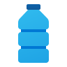
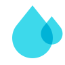
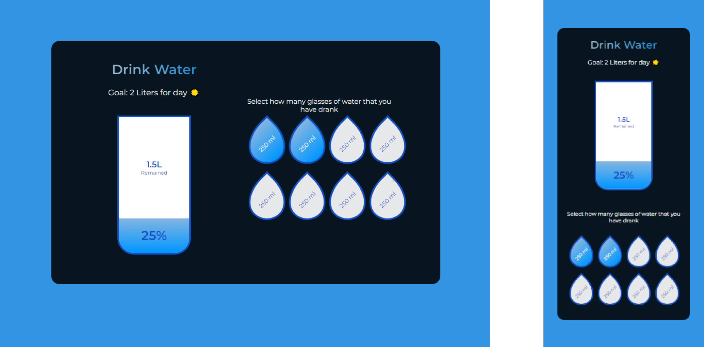

# 💧 I-drink-water

## ÍNDICE
* [1. Raffle-page](#1-Raffle-page )
* [2. Realization of the Project](#2-Realización-del-Proyecto)
* [3. Technologies used](#3-Technologies-used)
* [4. Authors ](#4-Authors )

***

# 1. 💧 I-drink-water

🧪 This app helps you count how much water  you drink 🥤 in the day ☀️ and thus stay hydrated 💧 with the correct ✔️ amount. Ideal for kids and adults.

***

# 2. Realization of the Project
## 2.1 Design 📱
### 2.1.1 Low Fidelity Prototyping: 📝

When defining what content would go on the web page, a rough prototype of the distribution was made, with pencil and paper.

### 2.1.2 Wireframe: 🙋🏼
Therefore, in this phase we seek to make a more detailed virtual distribution scheme in Figma.

### 2.1.2 High Fidelity Prototyping: 💁🏼
After having the Wireframe, the web design is made based on styles, color palette, among other resources.

## 2.2 Result of the project: 📱

Below is attached the [link to deploy the project.](https://rjrch123.github.io/I-drink-water/)

***

# 3. Technologies used 👩🏾‍💻
### 3.1 For structure and design:
-   [HTML:](https://developer.mozilla.org/es/docs/Web/HTML)  Following the rules of semantic HTML, the project was structured.

-   [CSS:](https://developer.mozilla.org/es/docs/Web/CSS) Used to define the visual style of the project.

-   [Figma:](https://www.figma.com) Platform to create the prototype structures (Wireframe, high-fidelity prototype, mockups).

### 3.2 For Testing:
-   [Jest:](https://jestjs.io/docs/es-ES/getting-started)  Framework to perform unit tests.
### 3.3 For functionality:
-   [Javascript:](https://developer.mozilla.org/es/docs/Web/JavaScript)  To give functionality to the platform.

***

# 4. Authors: 📍
-  [Rosamaria Rodriguez](https://github.com/RJRCH122)

